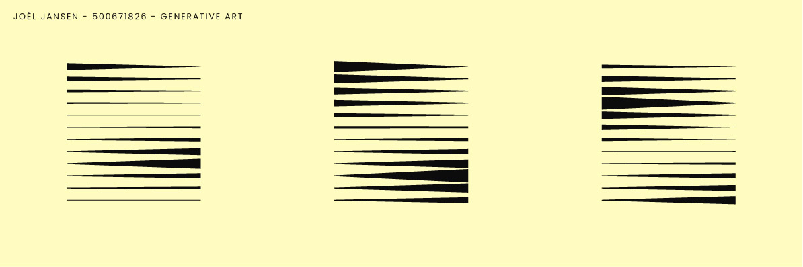
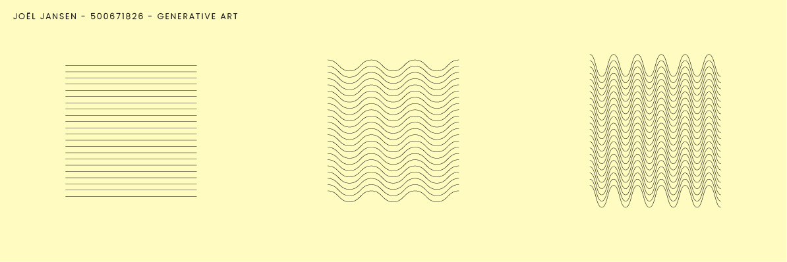

# generative-art
Generative Art - Vorm &amp; Detail - Webanimatie - I like all dit

Eerste hersenspinsels:
- Golven, golf die zichzelf tekent
- Wind die vlag laat wapperen
- Lijnen die verdubbelen, bewegen, verplaatsen etc.
- Generative art toepassen op eigen logo

Inspiratie:
- Katharina Brunner - https://aiartists.org/generative-art-design
- 36 Days of Type x p5.js - https://36xp5.site/

Ideeën sketch illustrator:

Feedback:
- Geluid van golven en wind toevoegen
- Minder minimalistisch, meer fantasierijk
- Uitgang van het concept goed
- Surfer toevoegen
