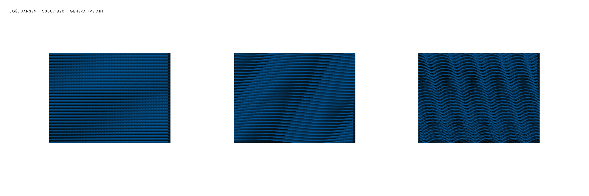
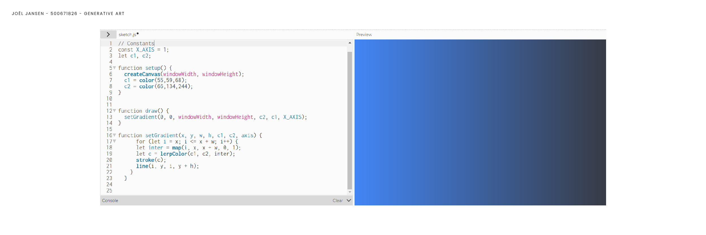

<!-- Vergeet je niet de comments uit te zetten voordat je begint met typen? 💬 -->

# Procesverslag

## Over
* **Naam: Joël Jansen** `voornaam + achternaam`
* **Klas: vid-2** `vid-1/vid-2`
* **Minor: Visual Interface Design** `Visual Interface Design`
* **Favoriete dier: Olifanten, want ze zijn biggy** `Zeeotters zijn te gek!`
* **Startniveau: blauwish/rood** `blauw/rood/zwart`

## Concept

Golven die bewegen door de wind.

## Features

`Wat zijn de features in het project dat je gemaakt hebt? Waar kan ik op klikken? Waar zit de interactie?`

## Onderzoek & inspiratie
`Schrijf wat over je onderzoek en je inspiratie voor het project. Hoe kwam je concept tot stand?`

## Voortang

### Week-1
Eerste hersenspinsels:
- Golven, golf die zichzelf tekent
- Wind die vlag laat wapperen
- Lijnen die verdubbelen, bewegen, verplaatsen etc.
- Generative art toepassen op eigen logo

Inspiratie:
- Katharina Brunner - https://aiartists.org/generative-art-design
- 36 Days of Type x p5.js - https://36xp5.site/

Ideeën sketch illustrator:

Feedback:
- Geluid van golven en wind toevoegen
- Minder minimalistisch, meer fantasierijk
- Uitgang van het concept goed
- Surfer toevoegen

### Week-2
Op zoek gegaan naar voorbeelden van waves in p5.js en daaruit inspiratie op doen.
Deze code deels eigen aan het maken en aan het kijken wat voor effect wijzigingen hebben op het ontwerp.

Ook geprobeerd een Deep Sea gradient background toe te voegen, maar nog niet met succes. De losse background gradient is wel gelukt, maar het toepassen op de waves klopt nog niet.

Bronnen:
- https://p5js.org/examples/interaction-wavemaker.html 
- 

### Week-3
`Wat heb je gedaan? Wat ging goed? Wat kon beter?`

## Bronnenlijst

* `Link naar bron 1`
* `Link naar bron 2`
* `Link naar bron 3`
