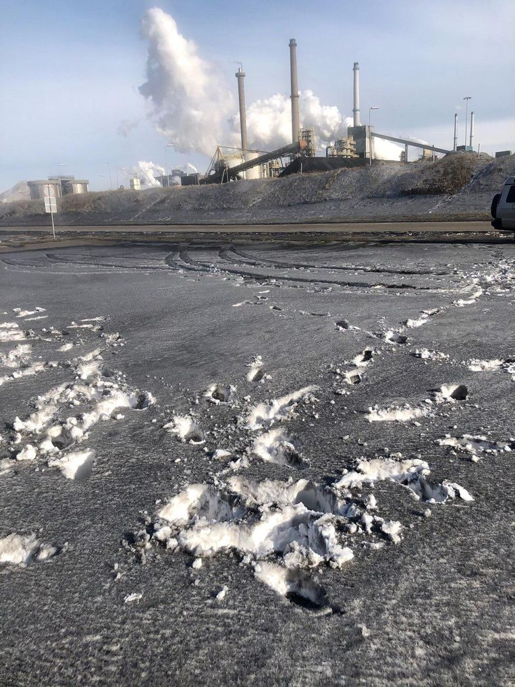
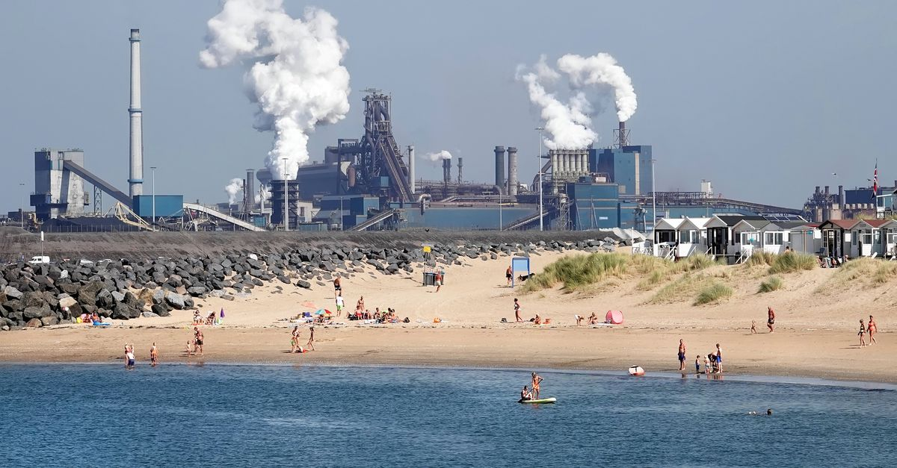
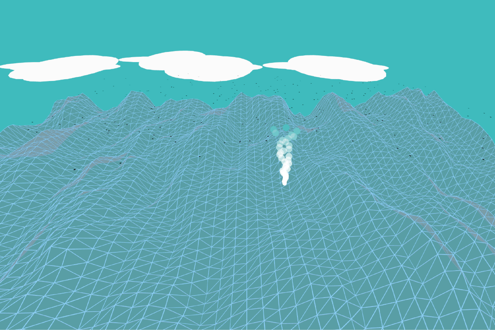

# Procesverslag

## Over
* **Naam: Joël Jansen** `voornaam + achternaam`
* **Klas: vid-2** `vid-1/vid-2`
* **Minor: Visual Interface Design** `Visual Interface Design`
* **Favoriete dier: Olifanten, want ze zijn biggy** `Zeeotters zijn te gek!`
* **Startniveau: blauwish/rood** `blauw/rood/zwart`

## Concept

Tata Steel in Wijk aan Zee zorgt voor milieuvervuiling en ook voor surfers (zoals ik). Met dit concept wil ik de situatie schetsen die er speelt en dit door verschillende elementen te laten terug komen. De gebruiker met de muis is de surfer en die moet de zwarte sneeuw ontwijken die er ontstaat door de vervuiling. Dat is bijna onmogelijk, maar wel realistisch.

## Features

- 3D golven gemaakt a.d.h.v. perlin noise.
- Surfer op de cursor die een witte trail achter laat net als in het echt. Gemaakt d.m.v. een smoke particle system
- Random zwarte sneeuw vlokken die vergroten en lastiger worden om te ontwijken
- Wolken die overwaaien, want zonder wolken geen neerslag

## Onderzoek & inspiratie
Zoals bij mijn concept beschreven speelt er zich een probleem af en daar heb ik persoonlijk ook last van. Misselijk/duizelig thuis komen na een surfessie bij Wijk aan Zee is niet meer speciaal. Dit is een probleem met veel media aandacht de laatste tijd en daarom wilde ik het ook niet aan mij voorbij laten gaan. Hierdoor wordt het conept heel persoonlijk en het eindresultaat realistischer door de vele ervaringen die ik er mee heb. 
Wijk aan Zee staat verder bekend als een top locatie voor surfen door de pier die er zit. Dit zorgt voor hoge golven, maar wel een klotsbak (golven die alle kanten op gaan en het dus echt een chaos is). Dit heb ik ook willen uitstralen met mijn gecreeërde golven. Tijdens slecht weer krijg je neerslag die je voelt en ruikt en afgelopen winter was dat zwarte sneeuw. Tijd om er iets aan te doen.

## Voortang

### Week-1
Eerste hersenspinsels:
- Golven, golf die zichzelf tekent
- Wind die vlag laat wapperen
- Lijnen die verdubbelen, bewegen, verplaatsen etc.
- Generative art toepassen op eigen logo

Inspiratie:
- Katharina Brunner - https://aiartists.org/generative-art-design
- 36 Days of Type x p5.js - https://36xp5.site/

Ideeën sketch illustrator:

Feedback:
- Geluid van golven en wind toevoegen
- Minder minimalistisch, meer fantasierijk
- Uitgang van het concept goed
- Surfer toevoegen

### Week-2
Op zoek gegaan naar voorbeelden van waves in p5.js en daaruit inspiratie op doen.
Deze code deels eigen aan het maken en aan het kijken wat voor effect wijzigingen hebben op het ontwerp.

Ook geprobeerd een Deep Sea gradient background toe te voegen, maar nog niet met succes. De losse background gradient is wel gelukt, maar het toepassen op de waves klopt nog niet.

Bronnen:
- https://p5js.org/examples/interaction-wavemaker.html 
- 

### Week-3 & weken erna
Doordat ik een tijd vast zat met de manier hoe ik golven creeërde, ben ik daarvan afgestapt en dit op een nieuwe manier te gaan doen.
De oude manier waren golven die constant bewogen en door middel van de muis de y en x waarden van de golven grote werden. Deze golven had ik gemaakt door middel van heel veel cirkels, dit maakte het geheel vooral heel laggy en niet aangenaam om mee te werken. Het is het ontwerp die ook bij week 2 staat maar dan met een aanvulling van the cursor die een lijn achter zich trekt. Dat gebeurt als de surfer door de golven snijdt met zijn board. Deze trail vond ik ook nog niet realistisch genoeg en heb ik later dus ook weer aangepast. 

Link naar deze versie: https://editor.p5js.org/Joelkenneth/sketches/atj7rqPlw

Ik wilde het concept wat persoonlijker maken dan alleen maar surfen en golven. Als ik zelf naar het strand ga om te surfen, ga ik 9 van de 10 keer naar Wijk aan Zee. Als je nog niet bekend met de situatie daar is hier een afbeelding om daarbij te helpen: 

De vervuiling van Tata Steel in Wijk aan Zee is de laatste tijd veel in het nieuws en er is afgelopen week zelfs door meer dan 1000 man aangifte gedaan. Afgelopen winter was de sneeuw zwart door het vuil in de lucht. Dit heb ik na gemaakt in mijn ontwerp, want uit de wolken die overwaaien valt de zwarte sneeuw in het water.

Om het geheel compleet te maken wilde ik een achtergrond foto van Wijk aan Zee er in plaatsen maar nar 100x proberen lukte dit niet. 
Hetzelfde geldt voor geluid. Ik wilde zee geluiden toevoegen, maar daar kreeg ik een wit scherm van. 

Code voor geluid:
var song;

function preLoad(){
song = loadSound("seasurfsound"); 
}

function setup() {
    song.play();
}

Helaas als laatste zit de surfer niet precies op de muis en dit komt door createCanvas(windowWidth, windowHeight, WEBGL); 
De WEBGL aan het einde is nodig voor de 3D terrain die in het ontwerp zit. Haal ik de WEBGL weg dan zit de surfer weer op de cursor, maar is het hele ontwerp weg.

Afbeelding van final ontwerp:

## Bronnenlijst

// clouds bron: https://editor.p5js.org/mena-landry/sketches/D7ql4Nd3V 
// 3D perlin noise waves bron: https://www.youtube.com/watch?v=IKB1hWWedMk
// Surfer / Smoke particle system bron: https://www.youtube.com/watch?v=UcdigVaIYAk
// Black snow/rain bron: https://p5js.org/examples/simulate-snowflakes.html
